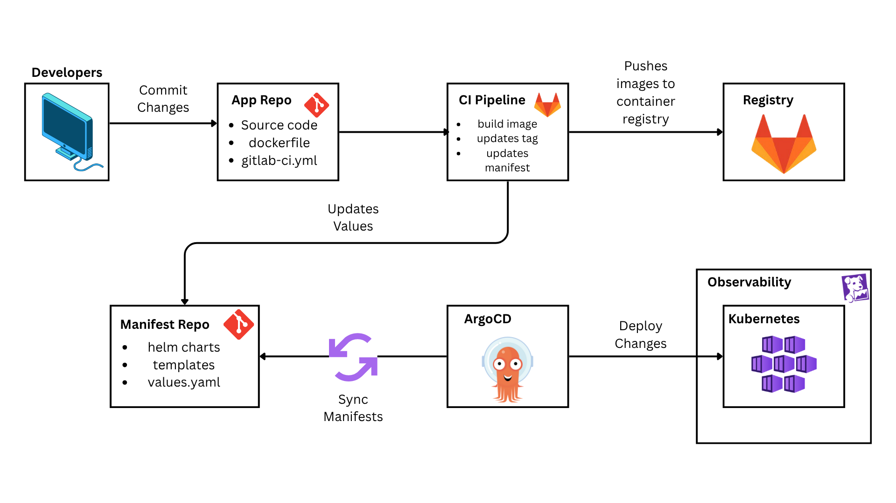

# 3-Tier Task Management Application Deployed on AKS Cluster with Datadog Monitoring

This repository contains a task management application and its complete DevOps implementation. The project demonstrates modern DevOps practices including containerization, Kubernetes orchestration on Kubernetes, CI/CD pipelines, GitOps workflows, Observability with Datadog.

## Project Overview

### Application Architecture
- **Frontend**: React-based UI for task management
- **Backend**: Node.js/Express REST API
- **Database**: PostgreSQL for data persistence

### DevOps Implementation
- Azure Kubernetes deployment
- Helm chart packaging
- GitLab CI/CD pipeline
- GitOps with ArgoCD
- Datadog Monitoring and Observability

### Implementation Workflow

Here is the implementation workflow for this project:



## Project Structure

```
.
├── app/                    # Application source code
│   ├── frontend/          # React frontend
│   ├── backend/           # Node.js API
│   └── database/          # PostgreSQL setup
│
└── docs/                  # Implementation guides
    ├── 01-local-setup.md    # Kubernetes setup
    ├── 02-helm-charts.md    # Helm configuration
    ├── 03-gitlab-ci.md      # CI/CD pipeline
    ├── 04-argocd-setup.md   # ArgoCD setup
    └── 05-deployment.md     # Deployment guide
```

## Documentation

- [Application Guide](./app/README.md) - Application setup and development
- [Quick Start Guide](./app/QUICKSTART.md) - Getting started quickly
- [Implementation Guide](./docs/README.md) - DevOps implementation steps

## Support

Need assistance?
1. Review the detailed documentation in the [docs](./docs) directory
2. Check error messages and logs
3. Refer to official documentation:
   - [Kubernetes](https://kubernetes.io/docs/)
   - [AKS](https://learn.microsoft.com/en-us/azure/aks/)
   - [Helm](https://helm.sh/docs/)
   - [GitLab CI](https://docs.gitlab.com/ee/ci/)
   - [ArgoCD](https://argo-cd.readthedocs.io/)
   - [Datadog](https://docs.datadoghq.com/)
4. Contact me on the following platforms:
   - [LinkedIn](https://www.linkedin.com/in/soqwapo/)
   - [Email](soquiat.marc11@gmail.com)