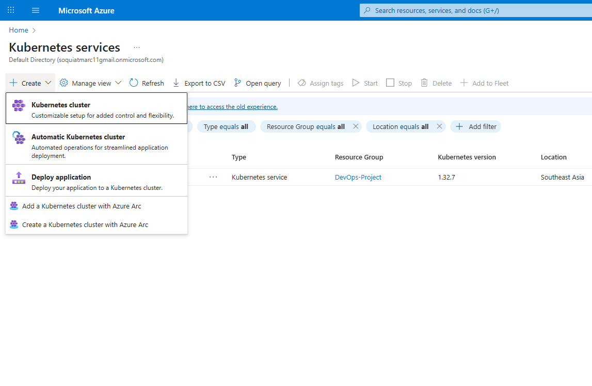
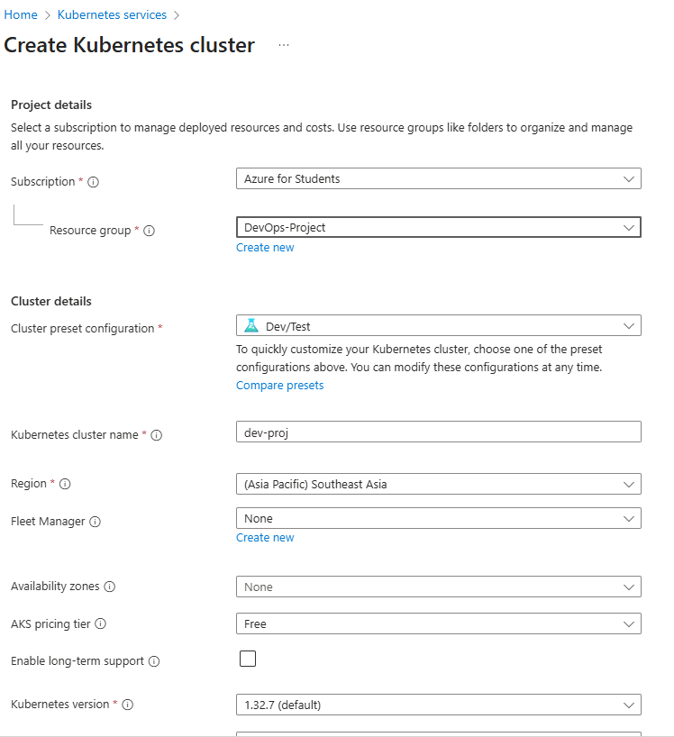
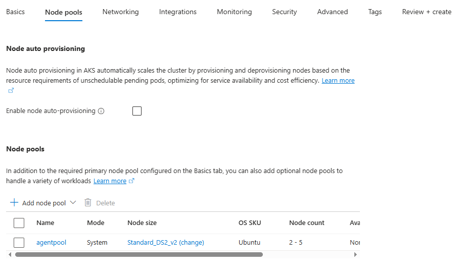
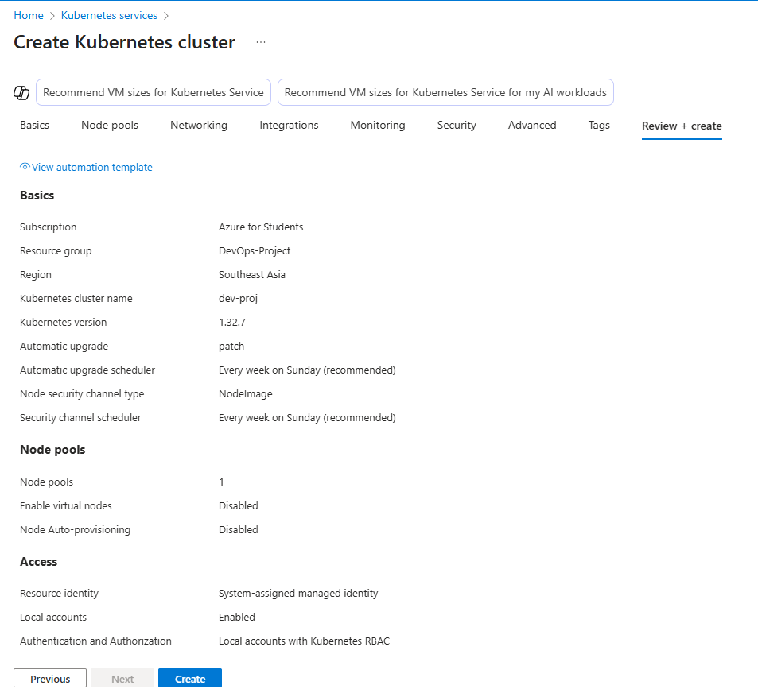

# Azure Kubernetes Service Setup

This guide will help you set up a AKS Cluster for development. We'll start small and build up step by step.

## Prerequisites:

1. Verified Microsoft Azure Account
2. Installed Kubernetes CLI (kubectl)

## AKS Cluster:

### Setup AKS Cluster

1. Navigate to AKS and Create a Cluster:



2. Fill in the details of the cluster to your preferred cluster name and resource group:



3. Click Next and navigate to Node Pools, change the Node Size Depending on your availability zone and application requirements



> [!NOTE]
> It is recommended to atleast have 16GB of RAM

4. Review + Create



> [!NOTE]
> Once validation comes through, create the cluster

### Connect to your AKS Cluster

1. [Install Azure CLI](https://learn.microsoft.com/en-us/cli/azure/install-azure-cli?view=azure-cli-latest)

2. Open your Command prompt and run the following commands:

Login to your azure account:
```bash
az login
```

Set the cluster subscription
```bash
az account set --subscription <YOUR SUBSCRIPTION ID>
```

Download cluster credentials
```bash
az aks get-credentials --resource-group <YOUR-RESOURCE-GROUP> --name <YOUR-CLUSTER-NAME> --overwrite-existing
```

> To know more details about your cluster, press the connect button on the cluster overview

## First Steps

After installing, try these commands:

```bash
# Check if kubectl is installed
kubectl version

# See your nodes
kubectl get nodes

# Check system pods
kubectl get pods -n kube-system
```

## Basic Concepts

### 1. Pods
- Smallest unit in Kubernetes
- Can have one or more containers
- Share network and storage

```bash
# List pods
kubectl get pods

# Get pod details
kubectl describe pod <pod-name>
```

### 2. Services
- Network abstraction
- Load balancing
- Service discovery

```bash
# List services
kubectl get services

# Access a service
kubectl port-forward service/<service-name> 8080:80
```

### 3. Deployments
- Manage pod replicas
- Handle updates
- Self-healing

```bash
# List deployments
kubectl get deployments

# Scale a deployment
kubectl scale deployment/<name> --replicas=3
```

## Test Your Setup

First, let's verify your cluster with a simple test:

```bash
# Create a namespace
kubectl create namespace test

# Run nginx
kubectl run nginx --image=nginx -n test

# Expose it
kubectl expose pod nginx --port=80 -n test

# Test access
kubectl port-forward pod/nginx 8080:80 -n test
```

Visit http://localhost:8080 in your browser to verify nginx is working.

## Common Issues

### 1. Microsoft Azure Subscription
- Make sure payment method is valid
- Ensure you have a valid subscription
- Make sure your account has credits

### 2. Cluster Creation
- Verify memory settings
- Check error messages
- Try with default settings first

### 3. kubectl Connection
- Check cluster status
- Verify configuration
- Try restarting cluster
- Make sure cluster is running

## Next Steps

Once your cluster is running:
1. Try deploying the task app manually
2. Setting up Helm

## Cheat Sheet

```bash
# Cluster
kubectl cluster-info         # Cluster information
kubectl get nodes           # List nodes
kubectl top nodes          # Node resource usage

# Resources
kubectl get pods           # List pods
kubectl get services       # List services
kubectl get deployments    # List deployments

# Namespaces
kubectl get namespaces     # List namespaces
kubectl create namespace   # Create namespace
kubectl delete namespace   # Delete namespace

# Debugging
kubectl logs <pod>         # View logs
kubectl exec -it <pod> sh  # Shell into pod
kubectl describe pod <pod> # Detailed pod info
```
