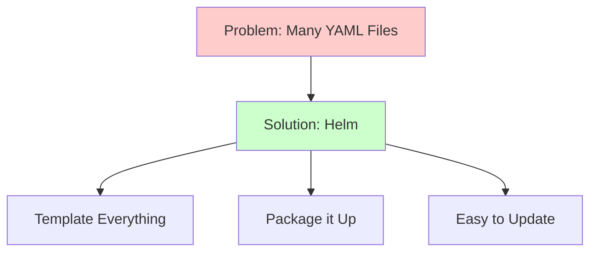
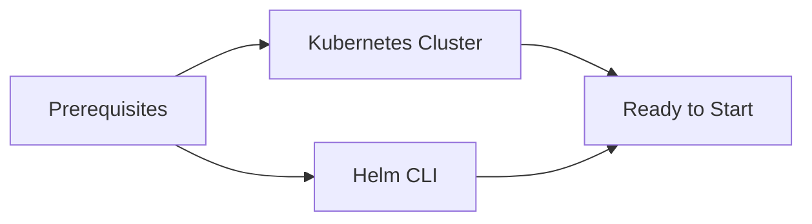
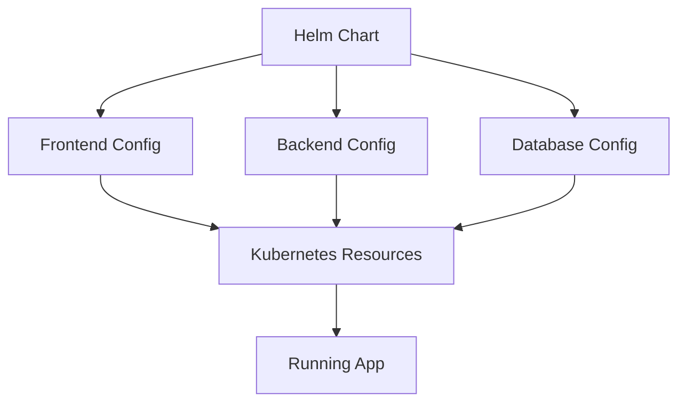

# Creating Your First Helm Chart

This guide will help you create a Helm chart for the task management application. We'll break it down into simple steps.

## What is Helm and Why Do We Need It?



Helm helps us manage Kubernetes applications by:
1. Templating repetitive YAML files
2. Packaging everything together
3. Making updates easier
4. Managing different environments

Think of it like:
- npm for Node.js (package.json)
- pip for Python (requirements.txt)
- But for Kubernetes applications!

## Before We Start

You'll need:


1. Working Kubernetes cluster (from previous guide)
2. Helm installed on your computer:
```bash
# macOS
brew install helm

# Windows
choco install kubernetes-helm
```

## What We'll Build

Here's what we're creating:



We'll convert our sample app from the `/app` directory into a Helm chart that can:
- Deploy all components
- Configure everything
- Make updates easy

### 1. Create Chart Structure
```bash
# Create a new chart
helm create task-app

# Clean up default templates
cd task-app
rm -rf templates/*
```

Note: We'll be converting the Docker Compose setup from the sample app into Kubernetes manifests managed by Helm.

### 2. Update Chart.yaml
```yaml
apiVersion: v2
name: task-app
description: Task Management Application
version: 0.1.0
appVersion: "1.0.0"
```

### 3. Create values.yaml
```yaml
# Global settings
global:
  environment: development

# Frontend configuration
frontend:
  image:
    repository: your-registry/frontend
    tag: latest
  service:
    type: ClusterIP
    port: 3000  # Using React's dev server port

# Backend configuration
backend:
  image:
    repository: your-registry/backend
    tag: latest
  service:
    type: ClusterIP
    port: 3000

# Database configuration
database:
  image:
    repository: postgres
    tag: "13-alpine"
```

## Creating Templates

### 1. Frontend Deployment (templates/frontend-deployment.yaml)
```yaml
apiVersion: apps/v1
kind: Deployment
metadata:
  name: frontend
spec:
  replicas: 1
  selector:
    matchLabels:
      app: frontend
  template:
    metadata:
      labels:
        app: frontend
    spec:
      containers:
      - name: frontend
        image: "{{ .Values.frontend.image.repository }}:{{ .Values.frontend.image.tag }}"
        ports:
        - containerPort: 80
```

### 2. Frontend Service (templates/frontend-service.yaml)
```yaml
apiVersion: v1
kind: Service
metadata:
  name: frontend
spec:
  type: {{ .Values.frontend.service.type }}
  ports:
  - port: {{ .Values.frontend.service.port }}
    targetPort: 3000  # React dev server port
  selector:
    app: frontend
```

## Testing Your Chart

### 1. Check Syntax
```bash
# Validate chart
helm lint .

# See what will be created
helm template .
```

### 2. Install Chart
```bash
# Create namespace
kubectl create namespace task-app

# Install chart
helm install my-release . -n task-app

# Check status
helm list -n task-app
```

### 3. Verify Deployment
```bash
# Check pods
kubectl get pods -n task-app

# Check services
kubectl get svc -n task-app

# Access the application
kubectl port-forward svc/frontend 3000:3000 -n task-app  # Frontend
kubectl port-forward svc/backend 3001:3000 -n task-app   # Backend

# Visit in your browser:
# Frontend: http://localhost:3000
# Backend API: http://localhost:3001
```

## Making Changes

### 1. Update Values
```bash
# Edit values.yaml or use --set
helm upgrade my-release . \
  --set frontend.replicas=2 \
  -n task-app
```

### 2. Rollback if Needed
```bash
# List revisions
helm history my-release -n task-app

# Rollback
helm rollback my-release 1 -n task-app
```

## Common Issues

### 1. Image Pull Errors
- Check image names
- Verify registry access
- Check pull secrets

### 2. Service Connection
- Verify service names
- Check port numbers
- Test with port-forward

### 3. Values Not Applied
- Check template syntax
- Verify value paths
- Use --debug flag

## Helm Commands Cheat Sheet

```bash
# Chart Management
helm create chart-name    # Create new chart
helm package .           # Package chart
helm lint .             # Check syntax

# Installation
helm install name .     # Install chart
helm upgrade name .     # Update release
helm rollback name 1    # Rollback release

# Information
helm list              # List releases
helm status name       # Release status
helm history name      # Release history

# Debugging
helm template .        # Validate templates
helm get manifest name # See what's installed
helm get values name   # See configs
```

## Next Steps

1. Add backend deployment
2. Configure database
3. Set up ingress
4. Test full application

## Getting Help

If you get stuck:
1. Use `helm --help`
2. Check template syntax
3. Ask during lab sessions

Remember:
- Start simple
- Test each change
- Use version control
- Ask questions when needed
