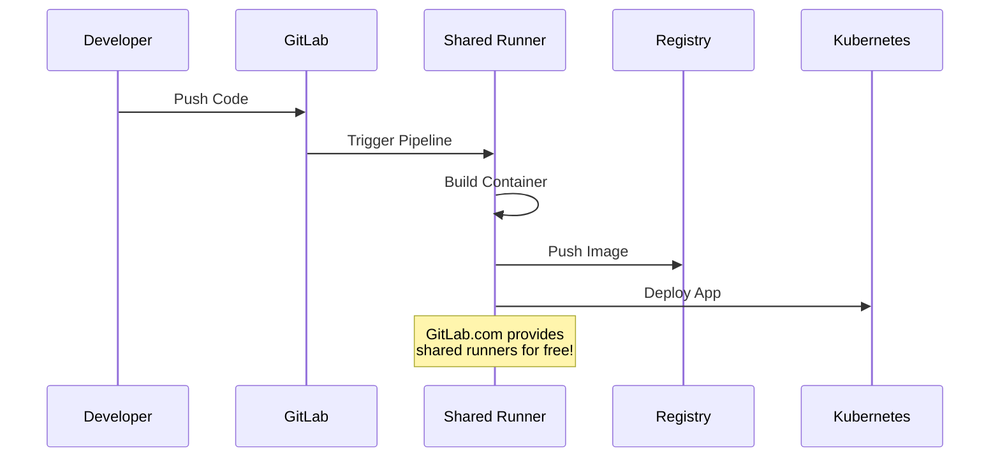
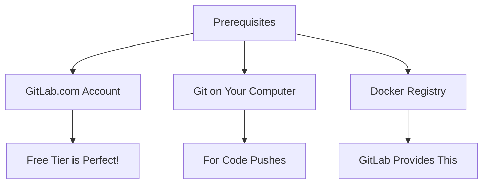
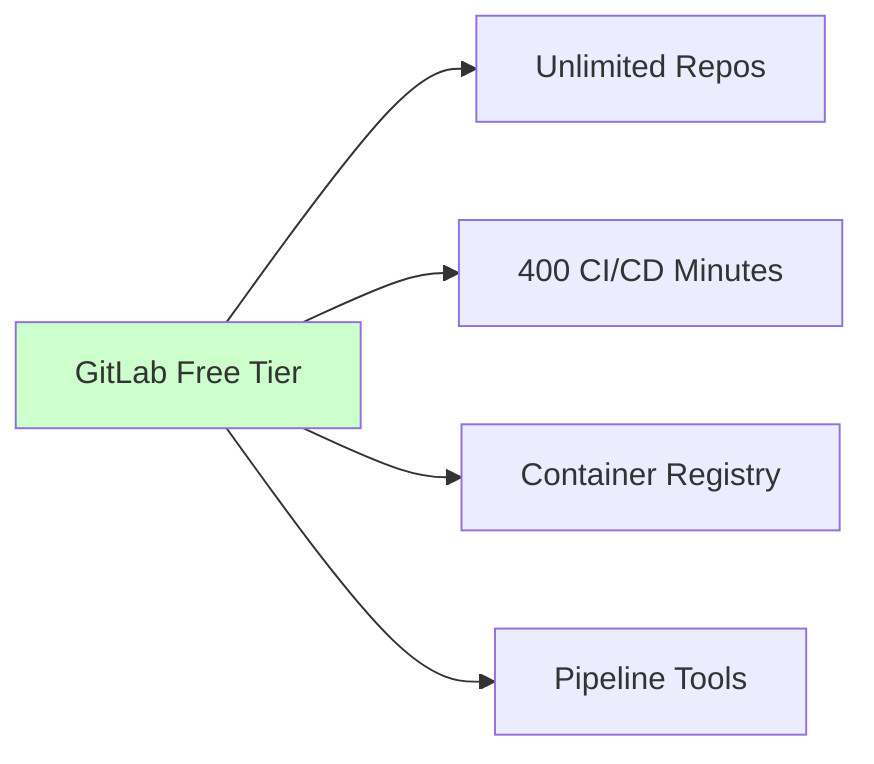

# Setting Up GitLab CI/CD

This guide will help you create an automated pipeline that builds and deploys your application. Don't worry if you're new to CI/CD - we'll explain everything!

## Understanding CI/CD

Let's break down what happens when you push code:



CI/CD automates this whole process:
- CI (Continuous Integration): Automatically builds your code into containers
- CD (Continuous Delivery): Automatically deploys these containers
- Everything starts with a git push!

## What You'll Need



1. GitLab.com Account
   - Sign up at https://gitlab.com
   - Free tier has everything we need
   - No credit card required

2. Git on Your Computer
   - Check with: `git --version`
   - Install from: git-scm.com

3. Docker Registry Access
   - GitLab.com provides this free
   - We'll use it to store our containers

## GitLab.com Free Features

Everything you need is included:


No need to set up your own GitLab server!

## Basic Pipeline

### 1. Create .gitlab-ci.yml
```yaml
# Basic pipeline structure
stages:
  - build
  - deploy

variables:
  DOCKER_REGISTRY: ${CI_REGISTRY}
```

### 2. Add Build Stage
```yaml
build-frontend:
  stage: build
  image: docker:20.10.16
  services:
    - docker:20.10.16-dind
  script:
    - docker login -u $CI_REGISTRY_USER -p $CI_REGISTRY_PASSWORD $CI_REGISTRY
    - docker build -t $CI_REGISTRY_IMAGE/frontend:$CI_COMMIT_SHA frontend/
    - docker push $CI_REGISTRY_IMAGE/frontend:$CI_COMMIT_SHA
  only:
    changes:
      - frontend/**/*
```

### 4. Add Deploy Stage
```yaml
deploy-dev:
  stage: deploy
  script:
    - kubectl apply -f kubernetes/
  environment:
    name: development
  only:
    - develop
```

## Setting Up GitLab

### 1. Create Repository
1. Go to GitLab.com and sign in
2. Click "New project" > "Create blank project"
3. Fill in:
   - Project name
   - Set visibility to Public or Private
   - Initialize with README (optional)
4. Push your code:
```bash
git init
git add .
git commit -m "Initial commit"
git remote add origin <your-repo-url>
git push -u origin main
```

### 2. Configure Variables
In GitLab > Settings > CI/CD > Variables:
```
CI_REGISTRY_USER: Your registry username
CI_REGISTRY_PASSWORD: Your registry password
KUBE_CONFIG: Your base64 encoded kubeconfig
```

## Testing the Pipeline

### 1. Make a Change
```bash
# Edit a file
echo "// test change" >> frontend/src/App.js

# Commit and push
git add .
git commit -m "Test CI pipeline"
git push
```

### 2. Watch Pipeline Run
1. Go to GitLab > CI/CD > Pipelines
2. Click on the latest pipeline
3. Watch stages execute

## Common Issues

### 1. Pipeline Failures
- Check job logs
- Verify variables
- Test scripts locally

### 2. Docker Build Issues
- Check Dockerfile
- Verify registry access
- Check image names

### 3. Deploy Issues
- Verify KUBE_CONFIG
- Check manifest files
- Test kubectl locally

## Pipeline Examples

### Basic Pipeline
```yaml
stages:
  - build
  - deploy

build-app:
  stage: build
  script:
    - docker build -t myapp .
```

### Multi-Stage Pipeline
```yaml
stages:
  - build
  - deploy

include:
  - template: Security/SAST.gitlab-ci.yml

variables:
  DOCKER_REGISTRY: ${CI_REGISTRY}
  DOCKER_IMAGE: ${CI_REGISTRY_IMAGE}:${CI_COMMIT_SHA}

build:
  stage: build
  script:
    - docker build -t $DOCKER_IMAGE .
    - docker push $DOCKER_IMAGE

deploy:
  stage: deploy
  script:
    - kubectl apply -f k8s/
```

## GitLab CI Features

### 1. Caching
```yaml
cache:
  paths:
    - node_modules/
```

### 2. Artifacts
```yaml
test:
  artifacts:
    paths:
      - coverage/
```

### 3. Dependencies
```yaml
deploy:
  dependencies:
    - build
```

## Useful Commands

```bash
# Docker (for local testing)
docker build -t name .              # Build image
docker push name                    # Push image
docker run name                     # Run container

# Kubernetes
kubectl apply -f file.yaml          # Apply manifest
kubectl get pods                    # Check pods
kubectl logs pod-name              # View logs
```

Note: You don't need to worry about GitLab runners! GitLab.com provides shared runners that will automatically run your pipeline. This is one of the benefits of using GitLab.com - the infrastructure is managed for you.

## Next Steps

1. Add more stages
2. Implement testing
3. Add security scanning
4. Configure environments

## Getting Help

If you get stuck:
1. Check job logs
2. Review pipeline syntax
3. Ask during lab sessions

Remember:
- Start with basic pipeline
- Test locally first
- Add features gradually
- Keep it simple!
