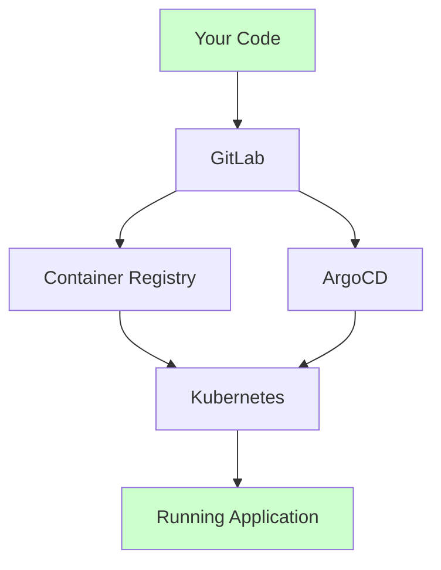
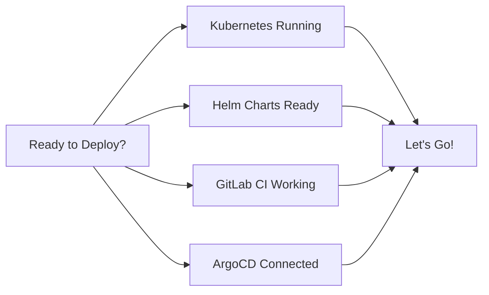
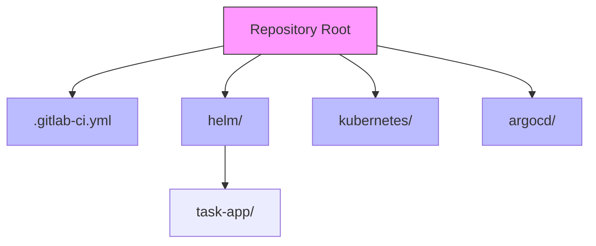

# Putting It All Together

This guide will help you deploy the complete task management application. We'll combine everything we've learned into a working system!

## The Complete Picture

Here's how all the pieces work together:



Let's check each part:
1. Your code is in GitLab
2. GitLab CI builds containers
3. ArgoCD watches for changes
4. Kubernetes runs everything

## Success Checklist



## Step-by-Step Deployment

### 1. Final Check

```bash
# Check cluster
kubectl cluster-info

# Check Helm
helm list

# Check ArgoCD
argocd app list
```

### 2. Repository Structure

Your repository should be organized like this:



Each part has a purpose:
- `.gitlab-ci.yml`: Pipeline configuration
- `helm/`: Application packaging
- `kubernetes/`: Raw manifests
- `argocd/`: GitOps configuration

### 3. Deploy Application

```bash
# Create namespace
kubectl create namespace task-app

# Deploy with ArgoCD
kubectl apply -f argocd/application.yaml
```

## Testing Everything

### 1. Check Components

```bash
# Check pods
kubectl get pods -n task-app

# Check services
kubectl get svc -n task-app

# Check ingress
kubectl get ingress -n task-app
```

### 2. Test Frontend
```bash
# Port forward frontend service
kubectl port-forward svc/frontend -n task-app 3000:3000
```
Visit http://localhost:3000 (React dev server)

### 3. Test Backend
```bash
# Port forward backend service
kubectl port-forward svc/backend -n task-app 3001:3000

# Test API
curl http://localhost:3001/api/health
```

Note: We're using the sample task management application from the `/app` directory with:
- Frontend running on port 3000 (React dev server)
- Backend API running on port 3001

## Making Changes

### 1. Update Frontend

1. Edit frontend code
2. Commit and push
3. Watch GitLab pipeline
4. Check ArgoCD sync

### 2. Update Backend

1. Edit backend code
2. Commit and push
3. Watch GitLab pipeline
4. Check ArgoCD sync

### 3. Update Configuration

1. Edit Helm values
2. Commit and push
3. Watch ArgoCD sync

## Verification Checklist

### 1. Infrastructure
- [ ] Kubernetes cluster running
- [ ] Ingress controller active
- [ ] Persistent volumes available

### 2. Applications
- [ ] Frontend pods running (React dev server on port 3000)
- [ ] Backend pods running (API on port 3001)
- [ ] Database running (PostgreSQL)
- [ ] Sample app from `/app` directory deployed successfully

### 3. Networking
- [ ] Services created
- [ ] Ingress working
- [ ] Internal DNS working

### 4. GitOps
- [ ] GitLab pipeline passing
- [ ] ArgoCD connected
- [ ] Auto-sync working

## Troubleshooting Guide

### 1. Pod Issues
```bash
# Check pod status
kubectl get pods -n task-app

# Check pod logs
kubectl logs <pod-name> -n task-app

# Describe pod
kubectl describe pod <pod-name> -n task-app
```

### 2. Service Issues
```bash
# Check endpoints
kubectl get endpoints -n task-app

# Test service DNS
kubectl run curl --image=curlimages/curl -i --rm --restart=Never -- \
  curl frontend:80
```

### 3. Pipeline Issues
```bash
# Check GitLab pipeline
gitlab-ci-local .gitlab-ci.yml

# Verify variables
gitlab variables list
```

### 4. ArgoCD Issues
```bash
# Check app status
argocd app get task-app

# Check sync
argocd app sync task-app

# Check logs
kubectl logs deployment/argocd-application-controller -n argocd
```

## Common Issues

### 1. Application Not Accessible
- Check ingress configuration
- Verify service endpoints
- Check pod health

### 2. Database Connection
- Verify credentials
- Check network policies
- Test connection string

### 3. Changes Not Deploying
- Check GitLab pipeline
- Verify ArgoCD status
- Review Git repository

## Quick Commands

```bash
# Health Checks
kubectl get pods -n task-app     # Check pods
kubectl top pods -n task-app     # Resource usage
kubectl logs -f <pod> -n task-app # Live logs

# Debugging
kubectl exec -it <pod> -n task-app -- sh  # Shell into pod
kubectl describe pod <pod> -n task-app    # Pod details
kubectl get events -n task-app            # Cluster events

# Cleanup
kubectl delete namespace task-app         # Remove everything
helm uninstall task-app                  # Remove Helm release
argocd app delete task-app               # Remove from ArgoCD
```

## Next Steps

1. Add monitoring
2. Set up logging
3. Configure backups
4. Implement scaling

## Getting Help

If you get stuck:
1. Check component logs
2. Review configurations

Remember:
- Test one component at a time
- Check logs for errors
- Verify configurations
- Keep it simple!
