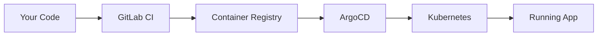
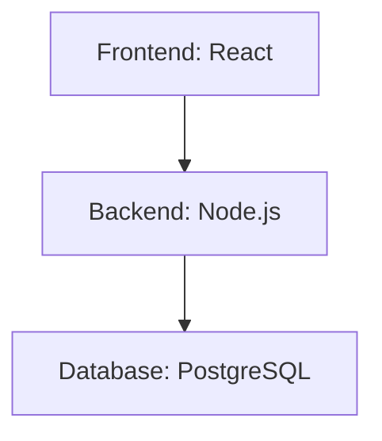
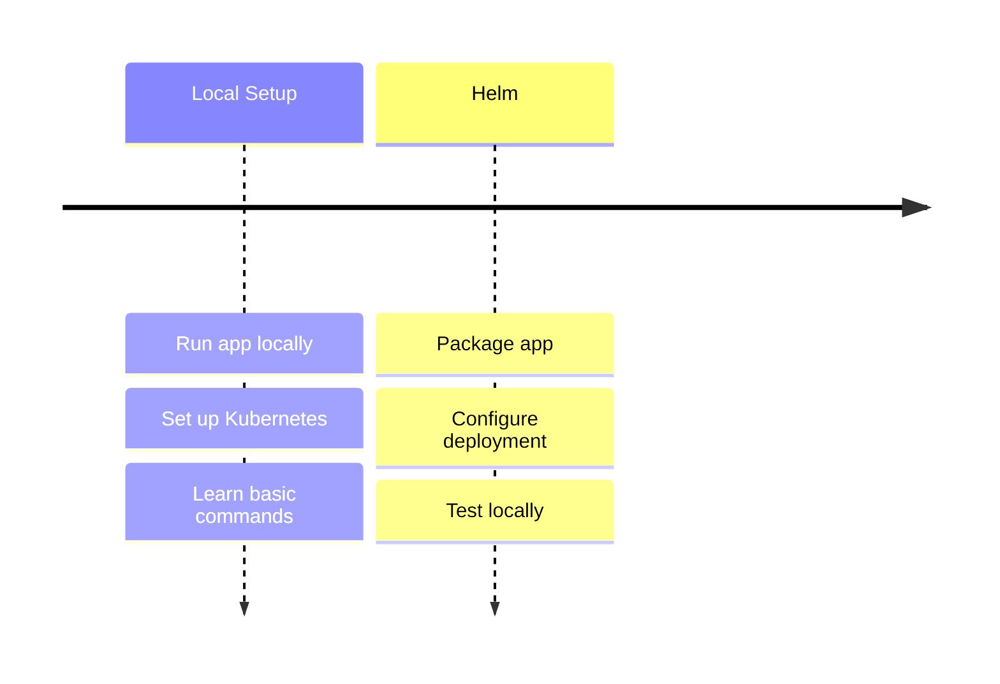
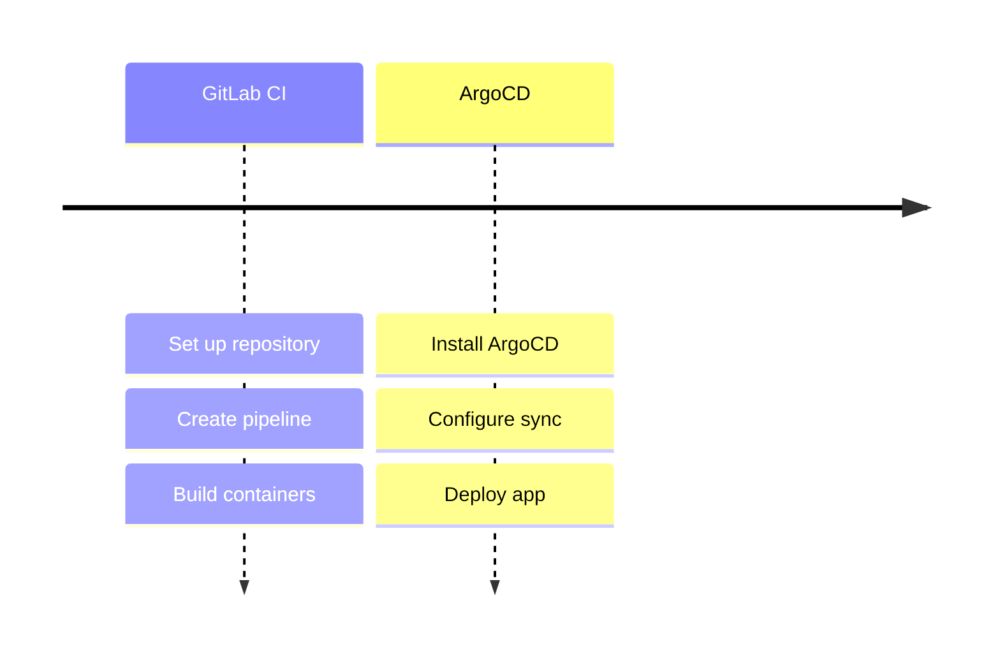

# DevOps Implementation Guide

Welcome! This guide will walk you through implementing DevOps practices for a simple task management application. Don't worry if some concepts are new - we'll explain everything step by step.

## The Big Picture

Before diving into the technical details, let's understand what we're building:



1. You'll write code and push to GitLab
2. GitLab CI automatically builds container images
3. ArgoCD watches for changes and updates Kubernetes
4. Your app runs in Kubernetes

This is called a "GitOps" workflow - everything starts with a git push!

## Starting Point: The Sample App

We'll use a simple task management application (provided in the `/app` directory) to learn DevOps practices. It has three parts:



First, let's make sure you can run it locally:
   ```bash
   cd app
   docker compose up
   ```

2. Test that it works:
   - Frontend: http://localhost:3000 (React dev server)
   - Backend API: http://localhost:3001
   - Try the features:
     * Create a task
     * Update its status
     * Delete the task

## Your Learning Journey

We'll implement DevOps practices in small, manageable steps:

### Week 1: Building the Foundation


### Week 2: Automation & GitOps


You'll learn to:

1. **Local Kubernetes Setup**
   - Choose a local Kubernetes solution
   - Set up your cluster
   - Learn basic Kubernetes concepts

2. **Helm Chart Creation**
   - Package the application
   - Configure deployments
   - Manage different environments

3. **CI/CD Pipeline**
   - Set up GitLab CI
   - Build containers
   - Automate deployments

4. **GitOps with ArgoCD**
   - Install ArgoCD
   - Configure applications
   - Implement GitOps workflow

## Step-by-Step Guides

1. [Local Development Setup](./01-local-setup.md)
   - Setting up your Kubernetes cluster
   - Basic concepts and commands
   - First deployment

2. [Helm Chart Creation](./02-helm-charts.md)
   - Creating your first chart
   - Converting our app
   - Testing deployments

3. [GitLab CI Setup](./03-gitlab-ci.md)
   - Pipeline configuration
   - Building images
   - Automated deployment

4. [ArgoCD Setup](./04-argocd-setup.md)
   - Installing ArgoCD
   - Application setup
   - GitOps workflow

5. [Deployment Guide](./05-deployment.md)
   - Putting it all together
   - Testing everything
   - Troubleshooting

## Getting Help

If you get stuck:
1. Check the app's documentation
2. Review error messages
3. Ask during lab sessions

## Timeline

### Week 1: Foundation
- Days 1-2: Local Kubernetes
- Days 3-4: Helm Charts
- Day 5: Review and fixes

### Week 2: Implementation
- Days 1-2: GitLab CI
- Days 3-4: ArgoCD
- Day 5: Final testing

Remember:
- Take it step by step
- Test each part
- Ask questions when needed
- Keep it simple!
